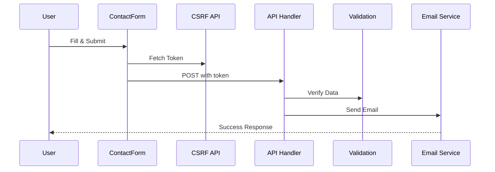

# Documentation

Welcome to the @goobits/forms documentation demo. This page demonstrates the docs-engine features.

## TOC

## Callouts

:::note
This is a note callout. Use it for helpful information.
:::

:::warning
This is a warning callout. Use it for important cautions.
:::

:::tip
This is a tip callout. Use it for best practices.
:::

## Code Highlighting

Here's an example with syntax highlighting:

```typescript
import { ContactForm } from '@goobits/forms/ui';
import { createContactApiHandler } from '@goobits/forms/handlers/contactFormHandler';

export const POST = createContactApiHandler({
	adminEmail: process.env.ADMIN_EMAIL,
	fromEmail: process.env.FROM_EMAIL,
	emailServiceConfig: {
		provider: 'nodemailer',
		smtp: {
			host: 'smtp.gmail.com',
			port: 587,
			auth: {
				user: process.env.SMTP_USER,
				pass: process.env.SMTP_PASS
			}
		}
	}
});
```

## Code Tabs

````tabs
```javascript tab="JavaScript"
// JavaScript example
const handler = createContactApiHandler({
	adminEmail: 'admin@example.com',
	fromEmail: 'noreply@example.com'
});
```

```typescript tab="TypeScript"
// TypeScript example
import type { RequestHandler } from '@sveltejs/kit';

export const POST: RequestHandler = createContactApiHandler({
	adminEmail: 'admin@example.com',
	fromEmail: 'noreply@example.com'
});
```
````

## File Tree

```filetree
src/
├── routes/
│   ├── api/
│   │   └── contact/
│   │       └── +server.js
│   └── contact/
│       └── +page.svelte
├── lib/
│   └── contact-config.js
└── hooks.server.js
```

## Mermaid Diagrams



## Math Rendering

Inline math: $E = mc^2$

Display math:

$$
\frac{d}{dx}\left( \int_{0}^{x} f(u)\,du\right)=f(x)
$$

## Links

Check out the [Cookbook](../../../../docs/cookbook.md) for practical recipes.

Or explore the [API Reference](../../../../docs/api-reference.md) for complete documentation.
