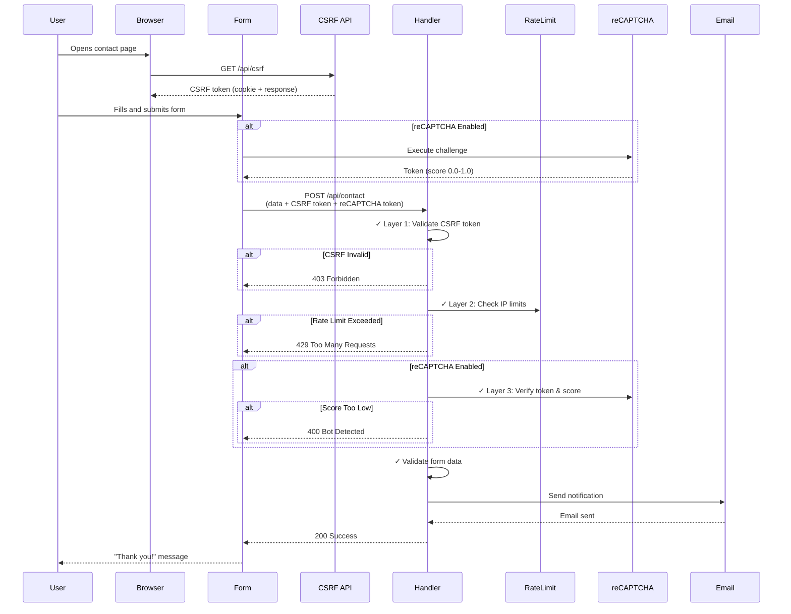

# Getting Started

Build your first form with @goobits/forms.

:::note Prerequisites
Before you begin, ensure you have:
- SvelteKit project initialized
- Node.js 18 or later
- pnpm 9 or later
:::

---

## Installation

Install the package and required dependencies:

```bash
npm install @goobits/forms
```

**Required peer dependencies:**
```bash
npm install @sveltejs/kit svelte formsnap sveltekit-superforms zod
```

**Optional dependencies** (for styling):
```bash
npm install @lucide/svelte clsx tailwind-merge
```

**Email service dependencies** (choose one):
```bash
# For Nodemailer (SMTP)
npm install nodemailer

# For AWS SES
npm install @aws-sdk/client-ses
```

---

## Start

Build a basic contact form in 3 steps.

### Step 1: Configure Your Form

Create form configuration:

````tabs
```javascript tab="JavaScript"
// src/lib/contact-config.js
export const contactConfig = {
	appName: 'My App',
	categories: {
		general: {
			label: 'General Inquiry',
			fields: ['name', 'email', 'message', 'coppa']
		}
	}
};
```

```typescript tab="TypeScript"
// src/lib/contact-config.ts
import type { ContactConfig } from '@goobits/forms/config';

export const contactConfig: ContactConfig = {
	appName: 'My App',
	categories: {
		general: {
			label: 'General Inquiry',
			fields: ['name', 'email', 'message', 'coppa']
		}
	}
};
```
````

Initialize in your app:

````tabs
```javascript tab="JavaScript"
// src/hooks.server.js
import { initContactFormConfig } from '@goobits/forms/config';
import { contactConfig } from '$lib/contact-config.js';

initContactFormConfig(contactConfig);

export async function handle({ event, resolve }) {
	return await resolve(event);
}
```

```typescript tab="TypeScript"
// src/hooks.server.ts
import type { Handle } from '@sveltejs/kit';
import { initContactFormConfig } from '@goobits/forms/config';
import { contactConfig } from '$lib/contact-config';

initContactFormConfig(contactConfig);

export const handle: Handle = async ({ event, resolve }) => {
	return await resolve(event);
};
```
````

:::note Architecture: Why hooks.server.js?
Configuration runs once at server startup, not on every request. This ensures:
- ✅ Better performance (config loaded once, not per-request)
- ✅ Consistent behavior across all requests
- ✅ Easy to share config between multiple API endpoints
- ✅ Type checking at build time, not runtime
:::

### Project Structure After Step 1

Your project should now have this structure:

```filetree
src/
├── lib/
│   └── contact-config.js       ← Form configuration
├── routes/
│   └── (routes will be added in next steps)
└── hooks.server.js             ← Initialize config here
```

**Available fields:**
- `name` - User's full name
- `email` - Email address
- `phone` - Phone number
- `message` - Message textarea
- `attachments` - File upload
- `coppa` - COPPA compliance checkbox
- `subject` - Subject line
- `category` - Category selector

---

### Step 2: Create API Handler

Create server endpoint to process form submissions:

````tabs
```javascript tab="JavaScript"
// src/routes/api/contact/+server.js
import { createContactApiHandler } from '@goobits/forms/handlers/contactFormHandler';

export const POST = createContactApiHandler({
	adminEmail: process.env.ADMIN_EMAIL,
	fromEmail: process.env.FROM_EMAIL,
	emailServiceConfig: {
		provider: 'mock' // Use 'mock' for development
	}
});
```

```typescript tab="TypeScript"
// src/routes/api/contact/+server.ts
import type { RequestHandler } from './$types';
import { createContactApiHandler } from '@goobits/forms/handlers/contactFormHandler';

export const POST: RequestHandler = createContactApiHandler({
	adminEmail: process.env.ADMIN_EMAIL!,
	fromEmail: process.env.FROM_EMAIL!,
	emailServiceConfig: {
		provider: 'mock' // Use 'mock' for development
	}
});
```
````

**Environment variables:**
```bash
# .env
ADMIN_EMAIL=admin@example.com
FROM_EMAIL=noreply@example.com
```

### Project Structure After Step 2

```filetree
src/
├── lib/
│   └── contact-config.js
├── routes/
│   └── api/
│       └── contact/
│           └── +server.js      ← API handler (Step 2 ✓)
└── hooks.server.js
```

---

### Step 3: Add Form to Page

Use the form component:

```svelte
<!-- src/routes/contact/+page.svelte -->
<script>
	import { ContactForm } from '@goobits/forms/ui';
	import '@goobits/forms/ui/variables.css';
	import '@goobits/forms/ui/ContactForm.css';
</script>

<h1>Contact Us</h1>
<ContactForm apiEndpoint="/api/contact" />
```

**Test your form:**
1. Start dev server: `npm run dev`
2. Navigate to `/contact`
3. Fill out and submit form
4. Check browser console for submission log (mock provider)

### Complete Project Structure

```filetree
src/
├── lib/
│   └── contact-config.js       ← Configuration
├── routes/
│   ├── api/
│   │   └── contact/
│   │       └── +server.js      ← API handler
│   └── contact/
│       └── +page.svelte        ← Form component (Step 3 ✓)
└── hooks.server.js             ← Config initialization
```

---

## Security Features

### Choosing Your Security Level

| Security Level | Features | Use When | Setup Time | Performance Impact |
|----------------|----------|----------|------------|-------------------|
| **Minimum** | CSRF only | Internal tools, authenticated users | 5 min | Minimal (~100ms) |
| **Standard** | CSRF + Rate limiting | Public contact forms, medium traffic | 10 min | Low (~150ms) |
| **Maximum** | CSRF + Rate limiting + reCAPTCHA | High-traffic, spam-prone forms | 20 min | Medium (~400ms) |

:::tip Decision Guide: Choosing Your Security Level
- ✅ **Minimum (CSRF only):** Internal forms, authenticated users only, low traffic
- ✅ **Standard (CSRF + Rate limiting):** Most public forms, no spam history ← **Start here**
- ✅ **Maximum (All features):** High-traffic public forms, spam-prone, abuse history
:::

:::note Why Layered Security?
Each layer protects against different threats:
- **CSRF:** Prevents cross-site attacks (malicious sites can't submit forms to your site)
- **Rate limiting:** Prevents abuse from single IP (stops brute force, DoS attempts)
- **reCAPTCHA:** Prevents automated bots (stops spam submissions)
:::

### Security Flow Visualization

See how the three security layers work together to protect your form:



---

### reCAPTCHA Protection

Protect against bots with Google reCAPTCHA v3.

**1. Get reCAPTCHA keys:**
- Go to [Google reCAPTCHA Admin](https://www.google.com/recaptcha/admin)
- Create new site (choose v3)
- Get site key and secret key

**2. Update configuration:**
````tabs
```javascript tab="JavaScript"
// src/lib/contact-config.js
export const contactConfig = {
	appName: 'My App',
	categories: { /* ... */ },
	recaptcha: {
		enabled: true,
		provider: 'google-v3',
		siteKey: 'YOUR_RECAPTCHA_SITE_KEY',
		minScore: 0.5 // 0.0 (bot) to 1.0 (human)
	}
};
```

```typescript tab="TypeScript"
// src/lib/contact-config.ts
import type { ContactConfig } from '@goobits/forms/config';

export const contactConfig: ContactConfig = {
	appName: 'My App',
	categories: { /* ... */ },
	recaptcha: {
		enabled: true,
		provider: 'google-v3',
		siteKey: 'YOUR_RECAPTCHA_SITE_KEY',
		minScore: 0.5 // 0.0 (bot) to 1.0 (human)
	}
};
```
````

**3. Update API handler:**
````tabs
```javascript tab="JavaScript"
export const POST = createContactApiHandler({
	adminEmail: process.env.ADMIN_EMAIL,
	fromEmail: process.env.FROM_EMAIL,
	recaptchaSecretKey: process.env.RECAPTCHA_SECRET_KEY
});
```

```typescript tab="TypeScript"
import type { RequestHandler } from './$types';

export const POST: RequestHandler = createContactApiHandler({
	adminEmail: process.env.ADMIN_EMAIL!,
	fromEmail: process.env.FROM_EMAIL!,
	recaptchaSecretKey: process.env.RECAPTCHA_SECRET_KEY!
});
```
````

**4. Add to environment:**
```bash
# .env
RECAPTCHA_SECRET_KEY=your_secret_key_here
```

---

### CSRF Protection

Protect against cross-site request forgery.

**1. Create CSRF endpoint:**
````tabs
```javascript tab="JavaScript"
// src/routes/api/csrf/+server.js
import { setCsrfCookie } from '@goobits/forms/security/csrf';

export async function GET(event) {
	const token = setCsrfCookie(event); // Generates token and sets cookie

	return new Response(JSON.stringify({ csrfToken: token }), {
		headers: { 'Content-Type': 'application/json' }
	});
}
```

```typescript tab="TypeScript"
// src/routes/api/csrf/+server.ts
import type { RequestEvent } from '@sveltejs/kit';
import { setCsrfCookie } from '@goobits/forms/security/csrf';

export async function GET(event: RequestEvent) {
	const token = setCsrfCookie(event); // Generates token and sets cookie

	return new Response(JSON.stringify({ csrfToken: token }), {
		headers: { 'Content-Type': 'application/json' }
	});
}
```
````

**2. Pass token to form:**
```svelte
<script>
	import { ContactForm } from '@goobits/forms/ui';
	export let data; // From +page.server.js
</script>

<ContactForm
	apiEndpoint="/api/contact"
	csrfToken={data.csrfToken}
/>
```

**3. Generate token on page load:**
````tabs
```javascript tab="JavaScript"
// src/routes/contact/+page.server.js
import { generateCsrfToken } from '@goobits/forms/security/csrf';

export async function load({ cookies }) {
	const csrfToken = generateCsrfToken();
	return { csrfToken };
}
```

```typescript tab="TypeScript"
// src/routes/contact/+page.server.ts
import type { PageServerLoad } from './$types';
import { generateCsrfToken } from '@goobits/forms/security/csrf';

export const load: PageServerLoad = async ({ cookies }) => {
	const csrfToken = generateCsrfToken();
	return { csrfToken };
};
```
````

:::tip Performance Optimization
Pre-fetching CSRF tokens in `+page.server.js` eliminates the 100-200ms auto-fetch delay on form submission. Without pre-fetching, the form makes an additional request to `/api/csrf` when the user clicks submit.
:::

---

## Email Configuration

### Development (Mock Provider)

For testing without sending real emails:

```javascript
emailServiceConfig: {
	provider: 'mock'
}
```

Submissions log to console instead of sending emails.

---

### Production (Nodemailer SMTP)

Send emails via SMTP (Gmail, SendGrid, Mailgun, etc.):

````tabs
```javascript tab="JavaScript"
emailServiceConfig: {
	provider: 'nodemailer',
	smtp: {
		host: 'smtp.gmail.com',
		port: 587,
		secure: false,
		auth: {
			user: process.env.SMTP_USER,
			pass: process.env.SMTP_APP_PASSWORD // Use app password, not account password
		}
	}
}
```

```typescript tab="TypeScript"
import type { EmailServiceConfig } from '@goobits/forms/services';

const emailServiceConfig: EmailServiceConfig = {
	provider: 'nodemailer',
	smtp: {
		host: 'smtp.gmail.com',
		port: 587,
		secure: false,
		auth: {
			user: process.env.SMTP_USER!,
			pass: process.env.SMTP_APP_PASSWORD! // Use app password, not account password
		}
	}
};
```
````

:::warning Gmail Setup Requirements
1. Enable 2-factor authentication on your Google account
2. Generate app password: [Google Account > Security > App Passwords](https://myaccount.google.com/apppasswords)
3. Use the 16-character app password (not your account password)
:::

**Environment variables:**
```bash
SMTP_USER=your-email@gmail.com
SMTP_APP_PASSWORD=your-app-password
```

---

### Production (AWS SES)

Send emails via Amazon Simple Email Service:

````tabs
```javascript tab="JavaScript"
emailServiceConfig: {
	provider: 'aws-ses',
	region: 'us-east-1',
	accessKeyId: process.env.AWS_ACCESS_KEY_ID,
	secretAccessKey: process.env.AWS_SECRET_ACCESS_KEY
}
```

```typescript tab="TypeScript"
import type { EmailServiceConfig } from '@goobits/forms/services';

const emailServiceConfig: EmailServiceConfig = {
	provider: 'aws-ses',
	region: 'us-east-1',
	accessKeyId: process.env.AWS_ACCESS_KEY_ID!,
	secretAccessKey: process.env.AWS_SECRET_ACCESS_KEY!
};
```
````

:::warning AWS SES Setup Requirements
1. Create AWS account
2. Verify sender email in SES console
3. Request production access (starts in sandbox mode - limited sending)
4. Create IAM user with SES sending permissions
5. Generate access keys for the IAM user
:::

**Environment variables:**
```bash
AWS_ACCESS_KEY_ID=your-access-key
AWS_SECRET_ACCESS_KEY=your-secret-key
```

---

## File Uploads

Enable image uploads with validation.

**1. Update configuration:**
````tabs
```javascript tab="JavaScript"
export const contactConfig = {
	appName: 'My App',
	categories: {
		support: {
			label: 'Technical Support',
			fields: ['name', 'email', 'message', 'attachments']
		}
	},
	fileSettings: {
		maxFileSize: 5 * 1024 * 1024, // 5MB in bytes
		acceptedImageTypes: [
			'image/jpeg',
			'image/png',
			'image/webp',
			'image/gif'
		]
	}
};
```

```typescript tab="TypeScript"
import type { ContactConfig } from '@goobits/forms/config';

export const contactConfig: ContactConfig = {
	appName: 'My App',
	categories: {
		support: {
			label: 'Technical Support',
			fields: ['name', 'email', 'message', 'attachments']
		}
	},
	fileSettings: {
		maxFileSize: 5 * 1024 * 1024, // 5MB in bytes
		acceptedImageTypes: [
			'image/jpeg',
			'image/png',
			'image/webp',
			'image/gif'
		]
	}
};
```
````

**2. Handle uploads server-side:**
````tabs
```javascript tab="JavaScript"
export const POST = createContactApiHandler({
	adminEmail: process.env.ADMIN_EMAIL,
	fromEmail: process.env.FROM_EMAIL,
	customSuccessHandler: async (data) => {
		if (data.attachments) {
			// File is base64-encoded in data.attachments
			// Store in S3, save to disk, or include in email
			console.log('File uploaded:', data.attachments);
		}
		return { message: 'Success!' };
	}
});
```

```typescript tab="TypeScript"
import type { RequestHandler } from './$types';
import type { ContactFormData } from '@goobits/forms/validation';

export const POST: RequestHandler = createContactApiHandler({
	adminEmail: process.env.ADMIN_EMAIL!,
	fromEmail: process.env.FROM_EMAIL!,
	customSuccessHandler: async (data: ContactFormData) => {
		if (data.attachments) {
			// File is base64-encoded in data.attachments
			// Store in S3, save to disk, or include in email
			console.log('File uploaded:', data.attachments);
		}
		return { message: 'Success!' };
	}
});
```
````

---

## Styling

### Import Base Styles

```svelte
<script>
	import '@goobits/forms/ui/variables.css';
	import '@goobits/forms/ui/ContactForm.css';
</script>
```

### Customize with CSS Variables

Override design tokens:

```css
/* app.css or +layout.svelte */
.forms-scope {
	/* Colors */
	--color-primary-500: #3b82f6;
	--color-primary-600: #2563eb;
	--color-error-500: #ef4444;
	--color-success-500: #10b981;

	/* Typography */
	--font-family-base: 'Inter', system-ui, sans-serif;
	--font-size-base: 1rem;

	/* Spacing */
	--spacing-4: 1rem;
	--spacing-6: 1.5rem;

	/* Border radius */
	--border-radius-medium: 0.5rem;
}
```

See [variables.css](https://github.com/goobits/forms/blob/main/ui/variables.css) for all available customization options.

### Override Component Styles

```css
/* Custom form styling */
.contact-form {
	max-width: 600px;
	margin: 2rem auto;
	padding: 2rem;
	background: white;
	border-radius: 0.5rem;
	box-shadow: 0 4px 6px rgba(0, 0, 0, 0.1);
}

.contact-form__submit-button {
	background: linear-gradient(135deg, #667eea 0%, #764ba2 100%);
}
```

---

## Internationalization

### Message Override

Override specific messages directly:

```svelte
<script>
	import { ContactForm } from '@goobits/forms/ui';

	const customMessages = {
		howCanWeHelp: '¿Cómo podemos ayudarte?',
		sendMessage: 'Enviar mensaje',
		sending: 'Enviando...',
		thankYou: '¡Gracias!',
		messageSent: 'Tu mensaje ha sido enviado.'
	};
</script>

<ContactForm messages={customMessages} />
```

### Auto-Detection with hooks.server.js

Enable automatic language detection in your SvelteKit hooks:

```javascript
// src/hooks.server.js
import { handleFormI18n } from '@goobits/forms/i18n';

export async function handle({ event, resolve }) {
	await handleFormI18n(event);
	return await resolve(event);
}
```

The `handleFormI18n` function detects the user's language from:
1. URL parameters (`?lang=es`)
2. Session storage
3. Browser accept-language headers

### Paraglide Integration

For complete translation management with Paraglide:

1. Install Paraglide:
```bash
npm install @inlang/paraglide-js
```

2. Initialize Paraglide in your project:
```bash
npx @inlang/paraglide-js init
```

3. Configure form messages in your Paraglide messages:
```javascript
// messages/en.json
{
  "form.howCanWeHelp": "How can we help you?",
  "form.sendMessage": "Send Message",
  "form.sending": "Sending..."
}

// messages/es.json
{
  "form.howCanWeHelp": "¿Cómo podemos ayudarte?",
  "form.sendMessage": "Enviar mensaje",
  "form.sending": "Enviando..."
}
```

4. Use with ContactForm:
```svelte
<script>
	import * as m from '$lib/paraglide/messages';

	const messages = {
		howCanWeHelp: m.form_howCanWeHelp(),
		sendMessage: m.form_sendMessage(),
		sending: m.form_sending()
	};
</script>

<ContactForm {messages} />
```

---

## Multiple Form Categories

Support different form types with category selection:

````tabs
```javascript tab="JavaScript"
// src/lib/contact-config.js
export const contactConfig = {
	appName: 'My App',
	categories: {
		general: {
			label: 'General Inquiry',
			icon: 'fa fa-envelope',
			fields: ['name', 'email', 'message']
		},
		support: {
			label: 'Technical Support',
			icon: 'fa fa-life-ring',
			fields: ['name', 'email', 'phone', 'message', 'attachments']
		},
		sales: {
			label: 'Sales Inquiry',
			icon: 'fa fa-shopping-cart',
			fields: ['name', 'email', 'phone', 'message', 'company']
		}
	}
};
```

```typescript tab="TypeScript"
// src/lib/contact-config.ts
import type { ContactConfig } from '@goobits/forms/config';

export const contactConfig: ContactConfig = {
	appName: 'My App',
	categories: {
		general: {
			label: 'General Inquiry',
			icon: 'fa fa-envelope',
			fields: ['name', 'email', 'message']
		},
		support: {
			label: 'Technical Support',
			icon: 'fa fa-life-ring',
			fields: ['name', 'email', 'phone', 'message', 'attachments']
		},
		sales: {
			label: 'Sales Inquiry',
			icon: 'fa fa-shopping-cart',
			fields: ['name', 'email', 'phone', 'message', 'company']
		}
	}
};
```
````

Use CategoryContactForm:
```svelte
<script>
	import { CategoryContactForm } from '@goobits/forms/ui';
</script>

<CategoryContactForm apiEndpoint="/api/contact" />
```

---

## Next Steps

**Add advanced features:**
- [Configuration Guide](./configuration.md) - All configuration options
- [API Reference](./api-reference.md) - Component documentation
- [TypeScript Guide](./typescript.md) - Type-safe form development

**Production deployment:**
- [Testing Guide](./testing.md) - Test your forms
- [Migration Guide](./migration.md) - Upgrade between versions

**Need help?**
- [Troubleshooting](./troubleshooting.md) - Common issues and solutions
- [Examples](../examples/) - Real-world implementations
- [GitHub Issues](https://github.com/goobits/forms/issues) - Report bugs or ask questions

---

**Reference:**

| Task | Code |
|------|------|
| Install | `npm install @goobits/forms` |
| Configure | `initContactFormConfig(config)` in `hooks.server.js` |
| Create API | `createContactApiHandler()` in `/api/contact/+server.js` |
| Add form | `<ContactForm apiEndpoint="/api/contact" />` |
| Import styles | `import '@goobits/forms/ui/ContactForm.css'` |
| Enable reCAPTCHA | Add `recaptcha: { enabled: true, ... }` to config |
| Enable CSRF | Create `/api/csrf/+server.js` endpoint |
| Customize colors | Override `--color-primary-500` in `.forms-scope` |

---

**Next steps:**
- [Configuration Guide](./configuration.md) - Customize your forms
- [API Reference](./api-reference.md) - Explore all components
- [Testing Guide](./testing.md) - Test your implementation
