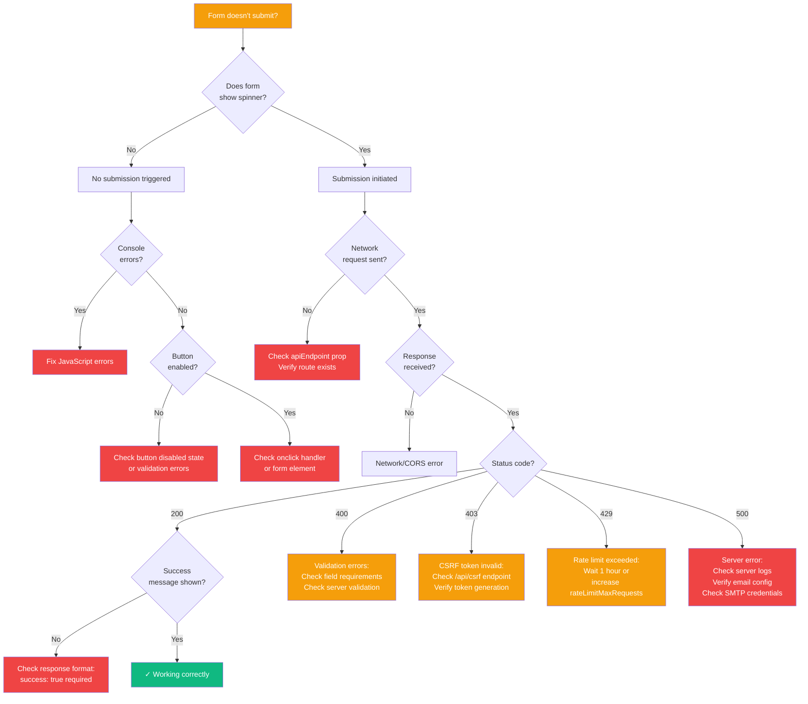

# Troubleshooting Guide

Common issues and solutions for @goobits/forms.

## TOC

**Quick Navigation:** [Import Errors](#import-errors) | [Form Submission](#form-submission) | [reCAPTCHA](#recaptcha-issues) | [Styling](#styling-issues) | [Email Delivery](#email-delivery) | [TypeScript](#typescript-errors)

---

## Import Errors

### Error: Cannot find module '@goobits/forms'

**Symptom:**
```
Error: Cannot find module '@goobits/forms'
```

**Solution:**
Install the package:
```bash
npm install @goobits/forms
```

---

### Error: Module not found: '@goobits/forms/ui'

**Symptom:**
```
Error: Cannot resolve '@goobits/forms/ui'
```

**Cause:** Incorrect import path or missing exports configuration.

**Solution:**
Check your import statements match the package exports:

```javascript
// RECOMMENDED: Correct
import { ContactForm } from '@goobits/forms/ui';
import { Menu } from '@goobits/forms/ui';
import { tooltip } from '@goobits/forms/ui/tooltip';
import { Modal } from '@goobits/forms/ui/modals';

// AVOID: Wrong
import { ContactForm } from '@goobits/forms'; // UI components not exported from root
```

See [API Reference](./api-reference.md) for correct import paths.

---

### Error: Component is not a constructor

**Symptom:**
```
TypeError: Component is not a constructor
```

**Cause:** Mixing default and named imports incorrectly.

**Solution:**
All UI components use named exports:

```javascript
// RECOMMENDED: Correct
import { ContactForm, FeedbackForm } from '@goobits/forms/ui';

// AVOID: Wrong
import ContactForm from '@goobits/forms/ui'; // No default export
```

---

## Form Submission

### Diagnostic Flowchart

Use this flowchart to quickly diagnose form submission issues:



---

### Form doesn't submit / No response

**Symptoms:**
- Form appears to submit but nothing happens
- No success/error message shown
- Console shows no errors

**Debugging steps:**

1. **Check API endpoint:**
```javascript
// Verify endpoint matches your server route
<ContactForm apiEndpoint="/api/contact" />
```

2. **Check server route exists:**
```bash
# File should exist at:
src/routes/api/contact/+server.js
```

3. **Check network tab:**
- Open browser DevTools → Network tab
- Submit form
- Look for POST request to `/api/contact`
- Check response status and body

4. **Enable debug logging:**
```javascript
import { configureLogger, LogLevels } from '@goobits/forms';

configureLogger({
	level: LogLevels.DEBUG,
	enabled: true
});
```

---

### Error: Failed to fetch CSRF token

**Symptom:**
```
Error: Failed to fetch CSRF token
```

**Cause:** No CSRF endpoint configured or CSRF middleware not set up.

**Solution:**

1. **Create CSRF endpoint:**
```javascript
// src/routes/api/csrf/+server.js
import { setCsrfCookie } from '@goobits/forms/security/csrf';

export async function GET(event) {
	const token = setCsrfCookie(event);
	return new Response(JSON.stringify({ csrfToken: token }), {
		headers: { 'Content-Type': 'application/json' }
	});
}
```

2. **Or pass token directly:**
```svelte
<script>
	export let data; // From +page.server.js
</script>

<ContactForm csrfToken={data.csrfToken} />
```

---

### Form submits but validation errors not shown

**Symptoms:**
- Form submits
- Server returns validation errors
- No errors displayed in UI

**Cause:** Server response format doesn't match expected structure.

**Solution:**

Server must return errors in this format:
```javascript
// Correct error response
return new Response(JSON.stringify({
	success: false,
	errors: {
		email: 'Invalid email format',
		message: 'Message is required'
	}
}), {
	status: 400,
	headers: { 'Content-Type': 'application/json' }
});
```

---

## reCAPTCHA Issues

### reCAPTCHA not loading

**Symptoms:**
- No reCAPTCHA badge appears
- Form submits without reCAPTCHA check

**Debugging:**

1. **Check configuration:**
```javascript
const config = {
	recaptcha: {
		enabled: true,
		provider: 'google-v3',
		siteKey: 'YOUR_SITE_KEY' // Must be valid
	}
};
```

2. **Verify site key:**
- Check Google reCAPTCHA admin console
- Ensure site key matches your domain
- For localhost: ensure localhost is added to allowed domains

3. **Check browser console:**
```
Failed to load reCAPTCHA: Invalid site key
```
Solution: Update site key in configuration.

---

### Low reCAPTCHA Scores

**Symptom:**
Forms consistently rejected with "reCAPTCHA verification failed"

**Cause:** Legitimate users getting scores below threshold.

**Solution:**

1. **Lower minimum score:**
```javascript
recaptcha: {
	enabled: true,
	provider: 'google-v3',
	minScore: 0.3 // Lower from default 0.5
}
```

2. **Check score distribution:**
```javascript
// Server handler
customSuccessHandler: async (data, clientAddress, recaptchaScore) => {
	console.log('reCAPTCHA score:', recaptchaScore);
	// Adjust threshold based on real scores
}
```

3. **Fallback for legitimate low scores:**
```javascript
// Allow manual review for borderline scores
if (recaptchaScore < 0.5 && recaptchaScore > 0.3) {
	// Flag for manual review instead of rejecting
	await flagForReview(data);
}
```

---

### Error: Invalid reCAPTCHA secret key

**Symptom:**
Server returns "Invalid reCAPTCHA configuration"

**Cause:** Secret key not set or incorrect.

**Solution:**

1. **Set environment variable:**
```bash
# .env
RECAPTCHA_SECRET_KEY=your_secret_key_here
```

2. **Pass to handler:**
```javascript
export const POST = createContactApiHandler({
	recaptchaSecretKey: process.env.RECAPTCHA_SECRET_KEY
});
```

3. **Verify key in Google console:**
- Check reCAPTCHA admin console
- Ensure using SECRET key (not site key)

---

## Styling Issues

### Styles not applying

**Symptoms:**
- Form appears unstyled
- Missing colors, spacing, or layout

**Solution:**

Import CSS files:
```javascript
// In your root layout or page
import '@goobits/forms/ui/variables.css';
import '@goobits/forms/ui/ContactForm.css';
```

**Check bundler configuration:**
- Ensure CSS imports are supported
- For Vite/SvelteKit: should work out of the box
- For custom bundlers: may need CSS loader

---

### Custom CSS variables not working

**Symptom:**
CSS variable overrides have no effect

**Cause:** Incorrect selector or specificity.

**Solution:**

Override variables in correct scope:
```css
/* RECOMMENDED: Target .forms-scope */
.forms-scope {
	--color-primary-500: #3b82f6;
	--font-family-base: 'Inter', sans-serif;
}

/* AVOID: Wrong selector */
:root {
	--color-primary-500: #3b82f6; /* Won't work */
}
```

See [variables.css](https://github.com/goobits/forms/blob/main/ui/variables.css) for all available variables.

---

### Form layout broken on mobile

**Symptom:**
Form overflows or has layout issues on mobile devices

**Solution:**

1. **Ensure viewport meta tag:**
```html
<meta name="viewport" content="width=device-width, initial-scale=1">
```

2. **Wrap form in container:**
```svelte
<div class="container">
	<ContactForm />
</div>

<style>
	.container {
		max-width: 600px;
		padding: 1rem;
		margin: 0 auto;
	}
</style>
```

---

## Email Delivery

### Emails not sending

**Symptoms:**
- Form submits successfully
- No emails received
- No errors in console

**Debugging:**

1. **Check email service configuration:**
```javascript
const handler = createContactApiHandler({
	adminEmail: 'admin@example.com', // Must be valid
	fromEmail: 'noreply@example.com', // Must be valid
	emailServiceConfig: {
		provider: 'mock' // Change to actual provider
	}
});
```

2. **Verify provider configuration:**

**For Nodemailer (SMTP):**
```javascript
emailServiceConfig: {
	provider: 'nodemailer',
	smtp: {
		host: 'smtp.gmail.com',
		port: 587,
		secure: false,
		auth: {
			user: process.env.SMTP_USER,
			pass: process.env.SMTP_PASS
		}
	}
}
```

**For AWS SES:**
```javascript
emailServiceConfig: {
	provider: 'aws-ses',
	region: 'us-east-1',
	accessKeyId: process.env.AWS_ACCESS_KEY_ID,
	secretAccessKey: process.env.AWS_SECRET_ACCESS_KEY
}
```

3. **Enable email logging:**
```javascript
logSubmissions: true // Logs email attempts
```

---

### Error: Invalid sender email

**Symptom:**
```
Error: Sender email not verified
```

**Cause (AWS SES):** Sender email not verified in SES.

**Solution:**
1. Go to AWS SES console
2. Verify email addresses or domain
3. Check verification status before sending

**Cause (Gmail SMTP):** Less secure apps blocked.

**Solution:**
1. Use App Password instead of regular password
2. Or switch to OAuth2 authentication

---

## TypeScript Errors

### Error: Could not find a declaration file

**Symptom:**
```typescript
Could not find a declaration file for module '@goobits/forms'
```

**Solution:**

Types are included in the package. Ensure TypeScript resolves them:

```json
// tsconfig.json
{
	"compilerOptions": {
		"moduleResolution": "bundler",
		"types": ["@goobits/forms"]
	}
}
```

---

### Type errors with form data

**Symptom:**
```typescript
Property 'email' does not exist on type 'unknown'
```

**Solution:**

Import and use type definitions:
```typescript
import type { ContactFormData } from '@goobits/forms/validation';

function handleSubmit(data: ContactFormData) {
	console.log(data.email); // Type-safe
}
```

See [TypeScript Guide](./typescript.md) for type documentation.

---

## Rate Limiting

### Error: Too many requests

**Symptom:**
```
Error: Rate limit exceeded. Please try again later.
```

**Cause:** User exceeded rate limit threshold.

**Solution:**

1. **Adjust rate limits:**
```javascript
createContactApiHandler({
	rateLimitMaxRequests: 10, // Increase from default 3
	rateLimitWindowMs: 60000   // Change from default 1 hour to 1 minute
});
```

2. **Implement better user feedback:**
```javascript
// Show countdown timer
rateLimitMessage: 'Too many requests. Please wait {seconds} seconds.'
```

3. **Use IP-based rate limiting:**
Rate limiting is automatically IP-based. Check if users share IPs (corporate networks, VPNs).

---

## File Uploads

### File upload fails silently

**Symptoms:**
- File selected but doesn't upload
- No error message shown

**Debugging:**

1. **Check file size:**
```javascript
fileSettings: {
	maxFileSize: 10 * 1024 * 1024 // Increase to 10MB
}
```

2. **Check file type:**
```javascript
fileSettings: {
	acceptedImageTypes: [
		'image/jpeg',
		'image/png',
		'image/webp',
		'image/gif',
		'application/pdf' // Add PDF support
	]
}
```

3. **Check server payload limits:**
```javascript
// SvelteKit endpoint
export const config = {
	bodySizeLimit: '10mb' // Match or exceed maxFileSize
};
```

---

## Browser Compatibility

### Form doesn't work in older browsers

**Cause:** Modern JavaScript features not supported.

**Solution:**

Ensure your build tooling transpiles modern features:

```javascript
// vite.config.js
export default {
	build: {
		target: 'es2015' // Or your target browser
	}
};
```

---

## Still Having Issues?

1. **Enable debug logging:**
```javascript
import { configureLogger, LogLevels } from '@goobits/forms';

configureLogger({
	level: LogLevels.DEBUG,
	enabled: true
});
```

2. **Check browser console** for errors and warnings

3. **Check network tab** for failed requests

4. **Search existing issues:** [GitHub Issues](https://github.com/goobits/forms/issues)

5. **Report a bug:** [Create an issue](https://github.com/goobits/forms/issues/new) with:
   - Error message and stack trace
   - Browser and version
   - Package version
   - Minimal reproduction code

---

**Still stuck?**
- [GitHub Issues](https://github.com/goobits/forms/issues) - Report bugs
- [API Reference](./api-reference.md) - Check usage examples
- [Configuration Guide](./configuration.md) - Verify settings
